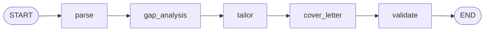

# sequential-resume-pipeline

A LangGraph pipeline that tailors a resume and drafts a cover letter for a
specific job description. Built as a sequential graph with structured
(Pydantic) state passed between stages, rather than a single freeform
LLM prompt.

## Pipeline design

Five stages, run in order:

1. **parse** — extract structured data (skills, experience bullets,
   requirements) from the raw resume and job description text.
   - **In:** the raw resume text and the raw job description text.
   - **Out:** from the resume — a list of skills and a list of experience
     bullets. From the job description — a list of required skills and a
     list of requirements.
2. **gap_analysis** — compare resume skills against JD requirements;
   produce matched skills, missing skills, and a match score.
   - **In:** the resume's skills, plus the job description's required
     skills and requirements.
   - **Out:** the skills that matched, the skills that are missing, and a
     match score out of 100.
3. **tailor** — rewrite/reorder resume bullets to emphasize what matches,
   using the gap report.
   - **In:** the resume's original experience bullets, plus the matched
     and missing skills from the gap analysis.
   - **Out:** a rewritten, reordered list of experience bullets.
4. **cover_letter** — draft a cover letter that leans on the tailored
   bullets and addresses the top gaps.
   - **In:** the raw job description text, the tailored bullets, and the
     missing skills.
   - **Out:** the cover letter text.
5. **validate** — check that the tailored output actually covers the JD's
   key terms; produces a pass/fail and score.
   - **In:** the job description's required skills and requirements, the
     tailored bullets, and the cover letter text.
   - **Out:** a pass/fail flag, the key terms that are covered, the key
     terms still missing, and a validation score out of 100.



## Status

- [x] Project scaffolding (`pyproject.toml`, `.env` config)
- [x] `app/config.py` — Groq API key loaded via `pydantic-settings`
- [x] `app/loaders.py` — read resume/JD from `.txt` or `.pdf`
- [x] `app/state.py` — Pydantic models for pipeline state
- [x] `app/nodes.py` — the 5 node functions
- [x] `app/graph.py` — builds and compiles the `StateGraph`
- [x] `app/main.py` — entrypoint

## Setup

Requires Python 3.13+ and [uv](https://docs.astral.sh/uv/).

```bash
uv sync
cp .env.example .env
# then fill in GROQ_API_KEY in .env
```

## Run

```bash
uv run python -m app.main path/to/resume.pdf path/to/job_description.txt
```

Each run writes a timestamped folder under `output/` (e.g.
`output/run_20260712_143022/`) containing `result.json` — the full
pipeline state after all 5 stages.

### Try it with the sample data

Sample input files are included under `sample_data/` (one `.txt`, one
`.pdf`, to exercise both loader paths):

```bash
uv run python -m app.main sample_data/resume.txt sample_data/job_description.pdf
```

A pre-generated result from this exact command is checked in at
`sample_output/result.json`, so you can see the expected shape of the
output without needing a `GROQ_API_KEY` first.
